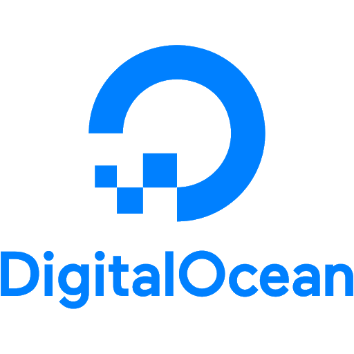

layout: true
background-image: url(slides_files/RStudio-Logo-Flat.png)
background-position: 2% 98%
background-size: 10%

---
name: title
class: inverse, center, middle

```{r setup, include=FALSE, warning=FALSE}
knitr::opts_chunk$set(echo = TRUE)
library(magrittr)
library(gt)
library(flair)
library(emo)
```

```{r include=FALSE, warning=FALSE}
xaringanExtra::use_share_again()
xaringanExtra::style_share_again(share_buttons = c("none"))
xaringanExtra::use_panelset()

```

# **APIs**: you're probably not using them and why you probably should
### Presented by: **Katie Masiello**

---
class: middle, center
#Where are you? 
#Where is your organization?

---
# Common Pain Points
* "I've created a Shiny beast!"

* "How do we share this code with another system / group?"

* "We are replicating work in every project"

---
class: inverse, center, middle
# Changing Data Science Landscape


---
# Data Science in 2021  

* Part of production applications  

* Beyond ad hoc reports, visualizations, and dashboards  

* Need to equip data scientists with production tools  

* Dependence on IT   

* To succeed, we need to embrace DevOps  

* How? Microservices    


---
# Monolithic Mindset
```{r  out.width = "60%", echo=FALSE, eval=TRUE, fig.align='center'}
knitr::include_graphics("slides_files/monolith.png")
```

---
# Lean it out with Microservices
```{r  out.width = "90%", echo=FALSE, eval=TRUE, fig.align='center'}

```

---
class: inverse, middle


.left[###The Single Responsibility Principle]
.center[# “Gather together those things that change for the same reason, and separate those things that change for different reasons.”]
.right[###&ndash; Robert C. Martin]

---
class: inverse, center, middle
# Okay, but how?
---
class: inverse, center, middle
# APIs, that's how.
---
class: inverse, center, middle
# AP-who?
---
# TL;DR - APIs

* Application Programming Interfaces  

* Machines talking to machines

* RESTful APIs use HTTP

* Think of HTTP as a universal language

---
# Think of APIs as a way to access functions
General form of an API: 
```
http://hostname/api_endpoint/?parameter=value
```

Example function:
```{r}
my_function <- function(argument) {
  some_kind_of_operation(argument)
}
```

As an API: 
```
http://hostname/my_function/?argument=value

```

---
# Think of APIs as a universal adapter

.center[] 
  
.center[ ]

---
# The Case for APIs

Traditional Data Science Tool Box

* Reports

* Presentations

* Spreadsheets

* Interactive Dashboards

* *all limited to end user consumption*
  
Extend your reach with APIs!

---
# The Case for APIs
.pull-left[<h3 style="margin-top: 0; color: #447099;">
Organizational </h3>

* Smaller pieces are easier to manage

* Component monitoring 

* Infrastructure for recycled code `r emo::ji("recycling_symbol")`

* Less technical debt! 

* Better change management

* Upgrade one service at a time without bringing down whole application

]

.pull-right[<h3 style="margin-top: 0; color: #447099;">
Collaborative </h3>

* Less friction and effort in tool handoff 

* Empower teams to use preferred tool chain `r emo::ji("fire")`

* Concerned about API requests not software language

* No need to translate work

* Programmatic use of services

* *Glue together API requests! Pipelines, baby!* 
]
---
class: inverse
name: Signs you might be ready to create an API

.left-column-impact[
<h6 style="color:#FFFFFF">  5</h6>
<h7>signs you might be ready to create an API</h7>
]

.right-column[
<br><br><br>
### Redundant code (copying and pasting/reusing)

### You have a large app that's hard to manage

### Other teams want your code

### Other teams may not know your language

### You want to integrate different software into one toolchain
]

---

class: inverse, center, middle

# How do you build an API?

---
# API frameworks

* R - plumber

* Python - Flask, Fast API

* JavaScript - Node.js & Express.js

---
class: inverse, center, middle

# How do you deploy an API?

---
# Deployment Options


* RStudio Connect <br>
 

* Digital Ocean <br> 

* Docker <br> 


---
class: inverse, center, middle

# Let's get into it

---
# Parts of an API
* **Host (fixed):**  
  * <span style="background-color:#fff2cc">`http://api.hostname.io/`</span>

* **Endpoint:** 
  * Resource location (think of as a function)
  * `http://api.hostname.io/`<span style="background-color:#fff2cc">`end-point`</span>

* **Parameters (optional):** 
  * Address varying parts of a request 
  * `http://api.hostname.io/end-point/`<span style="background-color:#fff2cc">`?param=value`</span>

* **Headers & body (optional):** 
  * (not in URL) Associated (meta)data 
---
# API Requests
* Each API endpoint has a different **method**  

* **GET**
  * Used to <span style="background-color:#fff2cc">*retrieve*</span> data. Parameters only. No body.
  * Everything is in the URL.
  * Don’t send sensitive data! 
  
* POST
  * Used for sending data (files or text). More secure.
  * Creating or modifying something.
  
* Other methods:
  * PUT
  * DELETE (yikes!) `r emo::ji("skull_and_crossbones")`
  * HEAD
  * …  


---
# Example: Go/No-Go Model

![:col_header , 
, 
]
![:col_row Susan has built a tool in R that provides Go/No-Go assertions,
Andrea needs to incorporate these assertions into her Python code to predict if it will rain, 
Mateo needs his daily metrics shown in Tableau to reflect these assertions]

--
```{r script, echo=TRUE}
#Go/No-Go script
sample(c("heads", "tails"), 1, 
       prob = c(0.5, 0.5), 
       replace = TRUE)
```
--
Yeah, it's a coin toss. Let's keep it simple. `r emo::ji("smile")`

---
class: inverse
.left-column-impact[
<h6 style="color:#FFFFFF">4</h6>
<h7>steps to making a plumber API</h7>
]

.right-column[
<br><br><br>
###1. Make it functional
###2. Add `plumber` decorations
###3. Save as **`plumber.r`**
###4. Publish
]
---
# Make it functional

.panelset[
.panel[.panel-name[Function basics]
* Functions are code shortcuts!

* Functions are a special kind of object

* Arguments are placeholders

* Things that change should be arguments

* Whatever is printed last is returned]
.panel[.panel-name[Coin Toss Function]
```{r coin_toss, include=FALSE}
sample(c("heads", "tails"), 1, 
       prob = c(0.5, 0.5), replace = TRUE)

#Function 1: toss once and give me a heads or tails output 
coin_toss <- function() {
  sample(c("heads", "tails"), 1, 
         prob = c(0.5, 0.5), replace = TRUE)
}
coin_toss()
```

```{r, echo=FALSE}
decorate("coin_toss") %>% 
  flair("function") %>% 
  knit_print.with_flair()
```


]
.panel[.panel-name[Multi-Toss Function]

```{r multi_toss, include=FALSE}
sample(c("heads", "tails"), 1, 
       prob = c(0.5, 0.5), replace = TRUE)

#Function 2: toss multiple times and summarize output
multi_toss <- function(n) {
  table(sample(c("heads", "tails"), n, 
               prob = c(0.5, 0.5), replace = TRUE)) %>% 
    as.data.frame()
}
multi_toss(500)
```

```{r, echo=FALSE}
decorate("multi_toss") %>% 
  flair_rx("\\bn\\b") %>% flair("1") %>% flair("500") %>% 
  knit_print.with_flair()
```

]
]

---
#You’ve basically made an API already

```{r}
#Function 1: toss once and give me a heads or tails output 
coin_toss <- function() {
  sample(c("heads", "tails"), 1, 
         prob = c(0.5, 0.5), 
         replace = TRUE)
}

#Function 2: toss multiple times and summarize output
multi_toss <- function(n) {
  table(sample(c("heads", "tails"), n, 
               prob = c(0.5, 0.5), 
               replace = TRUE)) %>% as.data.frame()
}
```


---
# The API
```{r, API, eval=FALSE}
library(plumber)

#* @apiTitle Coin Toss API

#* Toss a coin once and give the result
#* @get /coin_toss

function() {
  sample(c("heads", "tails"), 1, 
         prob = c(0.5, 0.5), replace = TRUE)
}

#* Toss a coin multiple times and summarize output
#* @param n the number of times to toss the coin
#* @get /multi_toss

function(n) {
  as.data.frame(
    table(sample(c("heads", "tails"), n, 
                 prob = c(0.5, 0.5), replace = TRUE)))
}

```
---
# The API - plumber code decoration `#*`
```{r, eval=FALSE}
library(plumber)

*#* @apiTitle Coin Toss API

#* Toss a coin once and give the result
#* @get /coin_toss

function() {
  sample(c("heads", "tails"), 1, 
         prob = c(0.5, 0.5), replace = TRUE)
}

#* Toss a coin multiple times and summarize output
#* @param n the number of times to toss the coin
#* @get /multi_toss

function(n) {
  as.data.frame(
    table(sample(c("heads", "tails"), n, 
                 prob = c(0.5, 0.5), replace = TRUE)))
}
```
---
# The API - plumber code decoration `#*`
```{r, eval=FALSE}
library(plumber)

#* @apiTitle Coin Toss API

*#* Toss a coin once and give the result
#* @get /coin_toss

function() {
  sample(c("heads", "tails"), 1, 
         prob = c(0.5, 0.5), replace = TRUE)
}

*#* Toss a coin multiple times and summarize output
#* @param n the number of times to toss the coin
#* @get /multi_toss

function(n) {
  as.data.frame(
    table(sample(c("heads", "tails"), n, 
                 prob = c(0.5, 0.5), replace = TRUE)))
}
```
---
## The API - plumber code decoration `#*`
```{r, eval=FALSE}
library(plumber)

#* @apiTitle Coin Toss API

#* Toss a coin once and give the result
#* @get /coin_toss

function() {
  sample(c("heads", "tails"), 1, 
         prob = c(0.5, 0.5), replace = TRUE)
}

#* Toss a coin multiple times and summarize output
*#* @param n the number of times to toss the coin
#* @get /multi_toss

function(n) {
  as.data.frame(
    table(sample(c("heads", "tails"), n, 
                 prob = c(0.5, 0.5), replace = TRUE)))
}
```
---
# The API - plumber code decoration `#*`
```{r, eval=FALSE}
library(plumber)

#* @apiTitle Coin Toss API

#* Toss a coin once and give the result
*#* @get /coin_toss

function() {
  sample(c("heads", "tails"), 1, 
         prob = c(0.5, 0.5), replace = TRUE)
}

#* Toss a coin multiple times and summarize output
#* @param n the number of times to toss the coin
*#* @get /multi_toss

function(n) {
  as.data.frame(
    table(sample(c("heads", "tails"), n, 
                 prob = c(0.5, 0.5), replace = TRUE)))
}
```
---
class: inverse, center, middle
# The Swagger Interface

???
When you save and run your API locally in the RStudio IDE, the Swagger interface allows you to interact with the API and test it
---
# Swagger
```{r  out.width = "80%", echo=FALSE, eval=TRUE, fig.align='center'}
knitr::include_graphics("slides_files/swagger.png")
```
---
# Publish the API 
Using RStudio Connect (push button deployment, git-backed deployment, or programmatic)
.center[**<https://colorado.rstudio.com/rsc/coin_api/>**]

```{r  out.width = "80%", echo=FALSE, eval=TRUE, fig.align='center'}
knitr::include_graphics("slides_files/published.png")
```
---
class: inverse, middle, center

#What have we done?
---
#Query our API from a browser
Single Coin Toss: 
<https://colorado.rstudio.com/rsc/coin_api/coin_toss>  <br><br>
  
Multi Coin Toss: 
<https://colorado.rstudio.com/rsc/coin_api/multi_toss?n=40> <br><br>
  
---
# Elements of our API call

`#* Toss a coin multiple times and summarize output`  
<span style="color:darkseagreen">`#* @param n the number of times to toss the coin`</span>  
<span style="color:orange">`#* @get /multi_toss`</span>  
```
function(n) {
  as.data.frame(
    table(sample(c("heads", "tails"), n, 
                 prob = c(0.5, 0.5), replace = TRUE)))
}
```


.center[
```{r, results = "asis", echo = FALSE}
"https://colorado.rstudio.com/rsc/ coin_api/multi_toss?n=40" %>%
  flair("https://colorado.rstudio.com/rsc/", color = "tomato") %>%
  flair("coin_api/", color = "cornflowerblue") %>%
  flair("multi_toss", color = "orange") %>%
  flair("?n=40", color = "darkseagreen") %>% 
  flair_all(before = "<h2>", after = "</h2>") %>%
  cat()
```

## <span style="color:tomato">host/</span><span style="color:cornflowerblue">RSC content path/</span><br><span style="color:orange">endpoint</span><span style="color:darkseagreen">?parameters</span>
]
---
class: inverse, middle, center
# That's great, now how do I use it?
---
class: inverse, middle, center
# Calling the API from R {httr}

---
.left-column-impact[
<h7 style="color:#447099"><br><br>API Call Steps</h7>
]

.right-column[
<br><br>
* ###Generate the query URL

* ###Make the request 

* ###Parse the response 

* ###(This pattern is the same for all languages)
]
---
# Creating the URL

1. Specify the base URL  

2. Create named list with parameters and values  

3. Use modify_url() to fill in parameters  

```{r, eval=FALSE}
library(httr)
base_url <- 
 "https://colorado.rstudio.com/rsc/coin_api/"

endpoint <- "multi_toss"

params <- list(n = 1000)

{{query_url <- modify_url(url = paste0(base_url, endpoint), }}
                              {{query = params) }}

```
`[1] "https://colorado.rstudio.com/rsc/coin_api/multi_toss?n=1000"`
---
# Send the request

* Use the appropriate method  

  * e.g. `GET()`, `POST()`, `PUT()`

<span style="background-color:#fff2cc">`(res <- GET(query_url))`</span>

```
> GET(query_url) 
Response [https://colorado.rstudio.com/rsc/coin_api/coin_toss]
  Date: 2021-01-08 18:56
  Status: 200
  Content-Type: application/json
  Size: 9 B
```
---
# Parse the request

```r

*(resp_raw <- content(res, as = "text"))


"[{\"entity\":\"germany\",\"year\":1975,\"product\":\"beans\",\"crop_yield\":2.8749}]" 

*jsonlite::fromJSON(resp_raw)


##    entity year product crop_yield
## 1 germany 1975   beans     2.8749
```
---
class: inverse, middle, center
# Recap
---
# Recap

* APIs: computers talking to computers
 
* RESTful APIs use HTTP
 
* HTTP is language agnostic
 
* Add APIs to your DS toolbox
 
* Reduce communication barriers
 
* Enable programmatic use of tools

---
To wrap up, showbarebones shiny app with all logic built into it vs shiny app that just calls the API

---
class: inverse, middle, center
# Thank you!
---
class: inverse, middle, center
# Let's talk about it.

---

class: center, middle  

# Shiny, I love you, but...

---
name: how it's going
class: inverse
.pull-left[
# How it started...

] 
--
.pull-right[
# How it's going

]

???
Often we start with a Shiny app that is a great fit for a problem.  But over time, often the app evolves. It can grow in complexity, or be tested to its limits as it becomes business critical. The care and feeding of the app can become burdensome.
---
name: signs it's time to break up
.left-column-impact[
<h6 > 7</h6>
<h7>signs it's time to break up</h7>
]

.right-column[
<br><br><br><br>
1. It's a monolith

1. Updating is scary / hard

1. The idea of handing it off or inheriting it is terrifying

1. Performance issues

1. Redundant code

1. Other teams want to use your code

1. Other teams or tools don't speak R

]

---
name: patterns to break up
class: inverse 

.left-column-impact[
<h6 style="color:#FFFFFF"> 4</h6>
<h7>Patterns to break up big apps</h7>
]

.right-column[
<br>
###1. Smart data refresh (e.g. &nbsp;)

###2. Write a  &nbsp; 

###3. APIs &nbsp;

###4. Use &nbsp; &nbsp; modules

]
---
